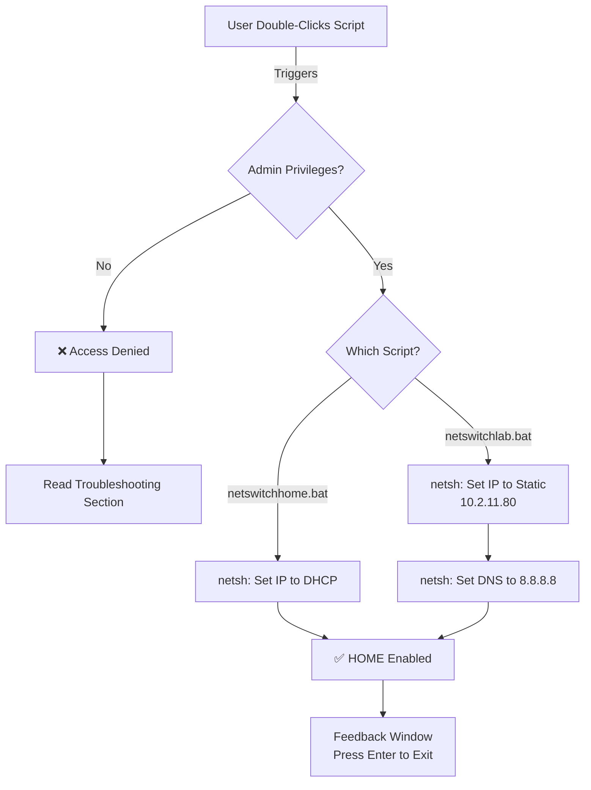

# 🌐 NetSwitch
**Automated Network Configuration Utility for Windows**

[NetSwitch](#netswitch) is a lightweight, Windows-native utility that streamlines the process of switching between **Dynamic (Home)** and **Static (Lab)** network environments. Designed for developers, network engineers, and students, it eliminates the need for manual command-line entry, ensuring a seamless transition between network types with just a double-click.

---

## 📋 Overview

In complex network environments, switching between DHCP (Dynamic Host Configuration Protocol) and Static IP configurations can be tedious. NetSwitch abstracts this complexity into two simple, user-friendly scripts.

| Feature | HOME Network | LAB Network |
| :--- | :--- | :--- |
| **Protocol** | DHCP (Automatic) | Static IP |
| **IP Address** | Assigned by Router | `10.2.11.80` |
| **Subnet Mask** | Auto-assigned | `255.255.252.0` |
| **Gateway** | Auto-assigned | `10.2.8.1` |
| **DNS** | Auto-assigned | `8.8.8.8` (Google DNS) |
| **Use Case** | Home, Office, Public Wi-Fi | Testing, Labs, Corporate Networks |

---

## 🏗️ Architecture

NetSwitch operates as a lightweight batch automation tool. It uses the Windows `netsh` API to modify network stack settings. The following diagram illustrates the execution flow:



---

## 🚀 Quick Start

### Prerequisites
- **OS**: Windows 10/11 (64-bit recommended)
- **Permissions**: Administrator rights
- **Network**: Standard Ethernet adapter (Default name: `Ethernet`)

### Installation
1. Download or clone this repository.
2. Extract the two batch files: `netswitchhome.bat` and `netswitchlab.bat`.
3. Place them in a preferred folder (e.g., `C:\Tools\NetSwitch`).

---

## 🛠️ How to Use

### 1️⃣ Switch to HOME Network (DHCP)
*Best for: Home, Office, or dynamic environments.*

1. Right-click `netswitchhome.bat`.
2. Select **"Run as administrator"**.
3. The script will configure the interface to request an IP from your local router.
4. **Success**: You will see `HOME network enabled successfully.`

### 2️⃣ Switch to LAB Network (Static)
*Best for: Lab environments requiring fixed IP addresses.*

1. Right-click `netswitchlab.bat`.
2. Select **"Run as administrator"**.
3. The script applies the static configuration:
   - **IP**: `10.2.11.80`
   - **Mask**: `255.255.252.0`
   - **Gateway**: `10.2.8.1`
   - **DNS**: `8.8.8.8`
4. **Success**: You will see `LAB network configured successfully.`

> 💡 **Tip**: Always verify your settings after running by opening Command Prompt and typing `ipconfig`.

---

## 🔧 Customization

You only need to edit these files if your computer's network interface has a custom name.

### Editing Interface Name
Both scripts look for a variable named `%eth%`. If your adapter is named `Wi-Fi` or `Local Area Connection`, modify this line in the script:

```batch
:: Default (Ethernet)
set eth=Ethernet

:: Example for Wi-Fi
set eth="Wi-Fi"
```

### Modifying LAB Settings
To change the Lab IP address or Gateway, edit `netswitchlab.bat`:

```batch
:: Modify your static IP line
netsh interface ip set address name="%eth%" static 192.168.1.50 255.255.255.0 192.168.1.1

:: Modify DNS line
netsh interface ip set dns name="%eth%" static 1.1.1.1
```

---

## ⚠️ Troubleshooting

| Issue | Possible Cause | Solution |
| :--- | :--- | :--- |
| **Access Denied** | Running without Admin rights | Right-click and select "Run as administrator". |
| **Wrong Network** | Interface name mismatch | Edit `%eth=` in the batch file to match your adapter name. |
| **No Internet** | Firewall/Antivirus block | Temporarily disable security software or add an exception for `netsh`. |
| **Settings Not Saving** | Network service reset | Restart the computer or the specific network adapter service. |

---

## 📜 License & Disclaimer

This tool is provided "as is" for educational and personal use.
- **Network Modification Warning**: Changing network configurations can temporarily disrupt connectivity. Always ensure you understand the IP subnet being applied to avoid network conflicts.
- **Data Backup**: If in doubt, perform a network backup (`ipconfig /all`) before making changes.

---

*Developed with 🧠 for efficient network management.*